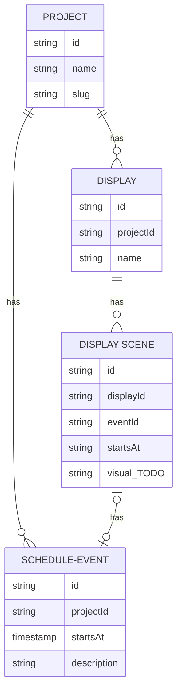

```mermaid
erDiagram    
    PROJECT {
        string id
        string name
        string slug
    }
    PROJECT ||--o{ SCHEDULE-EVENT : has
    SCHEDULE-EVENT {
        string id
        string projectId
        timestamp startsAt
        string description
    }
    PROJECT ||--o{ DISPLAY : has
    DISPLAY {
        string id
        string projectId
        string name
    }
    DISPLAY ||--o{ DISPLAY-SCENE : has
    DISPLAY-SCENE {
        string id
        string displayId
        string eventId
        string startsAt
        string visual_TODO
    }
    DISPLAY-SCENE |o--o| SCHEDULE-EVENT : has

```